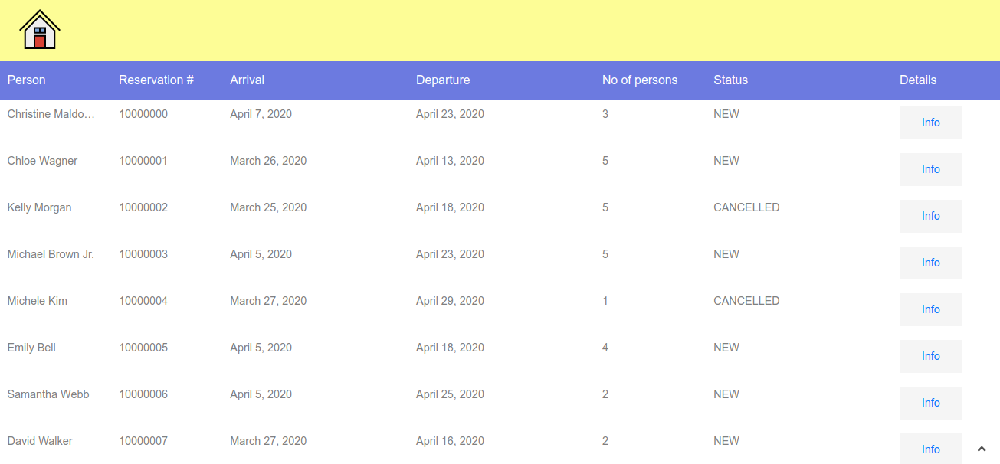
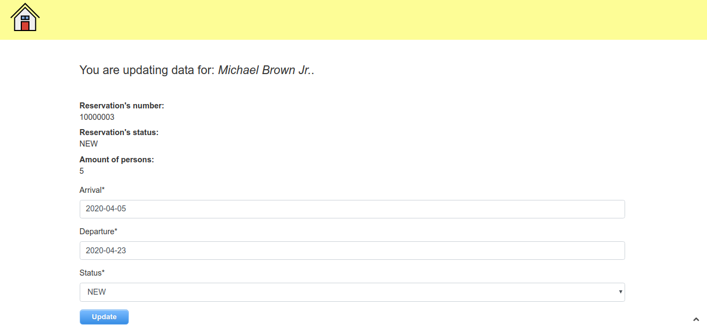
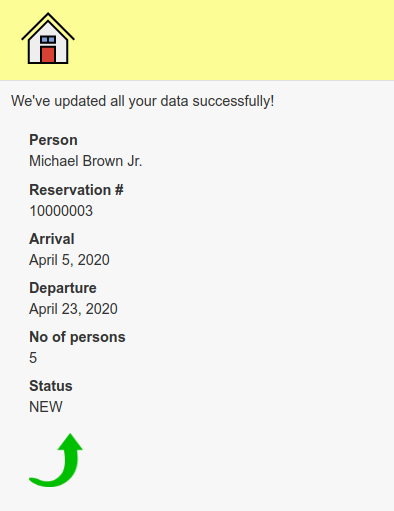

# Reservation system 
#### (task for Parklot)

The goal of this task is to create a simple reservation app in Django 2.2. Attached is a csv file containing (fake) reservation data. All data should be uploaded to the project using python script.

The main page should display paginated list of all reservations. 
Each reservation on the list should have its own subpage with all details and the option to edit reservation dates or change reservation status.

##

Project Technologies:<br>

```Django 2.2```<br>
```Python 3.6```<br>
```HTML```<br>
```CSS```<br>
```JavaScript```<br>
```Postgresql```<br>
```Pipenv```<br>
```Git```<br>

****************************************************************************************

Project Screenshots:

Home Page:



Update Page:




Confirmation Page:



------------------------------------------------------------------------------------------------------------------------

#### Author:<br>
Marcel Łagoda
